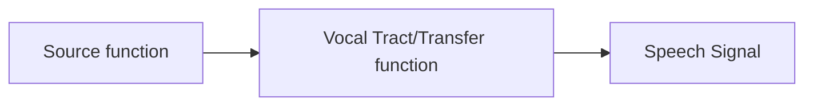

# W1L1

> * Mathematical models of production and perception mechanisms. Acoustics.
> * Text-to-Speech Synthesis \(TTS\)
> * Compression
> * Enhancement
> * Hearing aids
> * Entertainment industry
> * Automatic Speech Recognition \(ASR\)



```sequence
A->B:hello 
B->C:hello
C->A:hello
```

'''mermaid
graph LR
A[Source function] -->B[Vocal Tract or Transfer function] 
B --> C[Speech Signal]
'''

Children Speech are hard to recognition


graph TD;  A-->B; A-->C;  B-->D;  C-->D;


